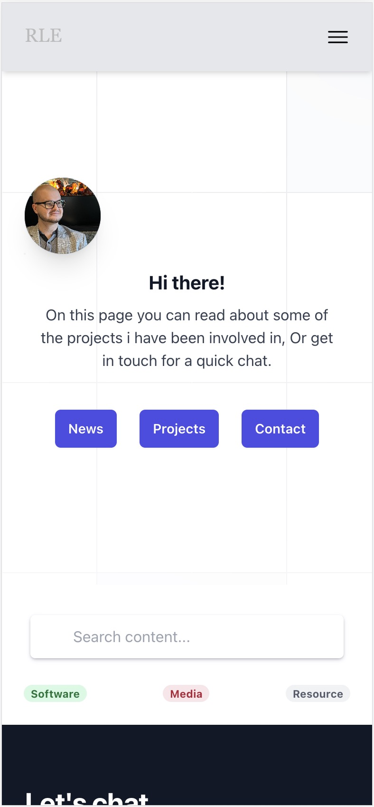
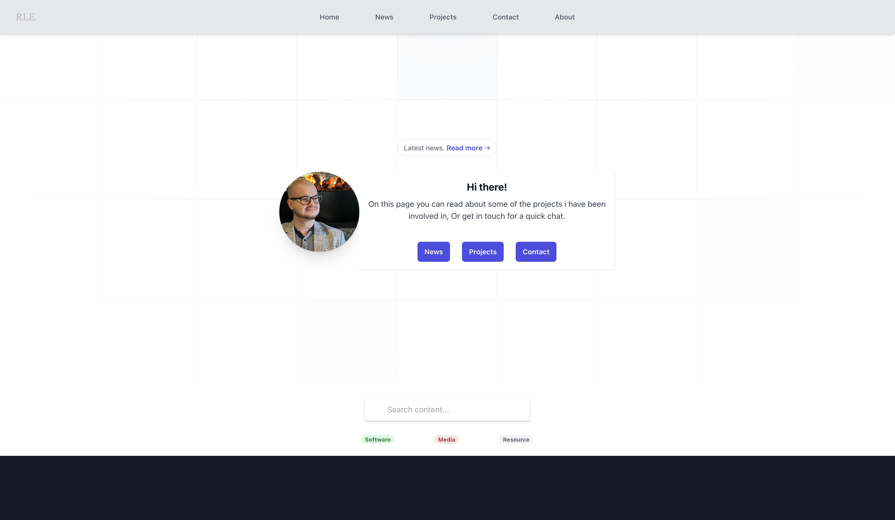
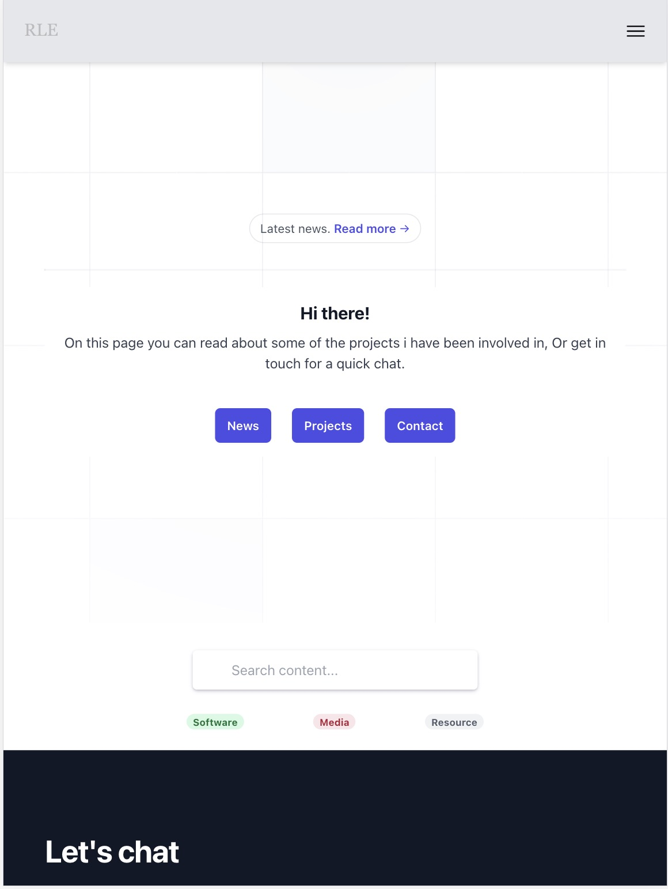
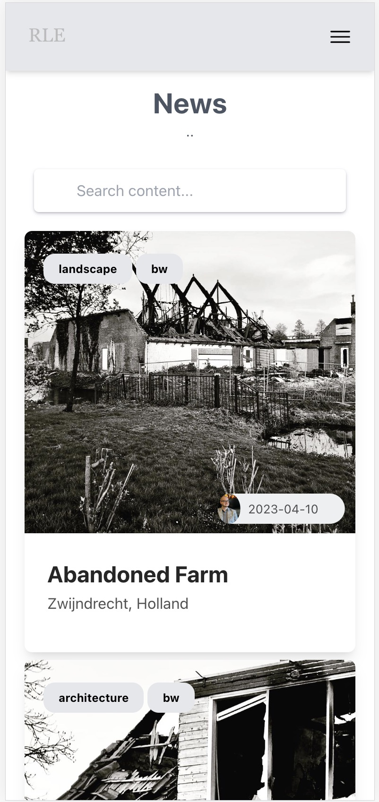
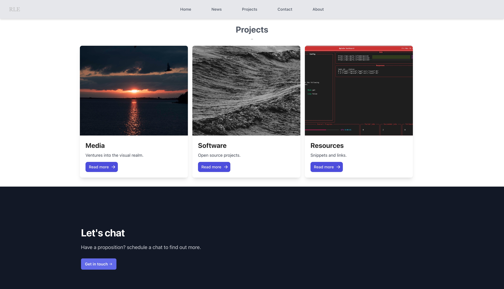
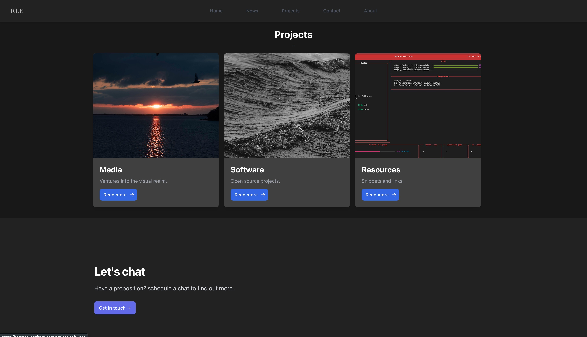
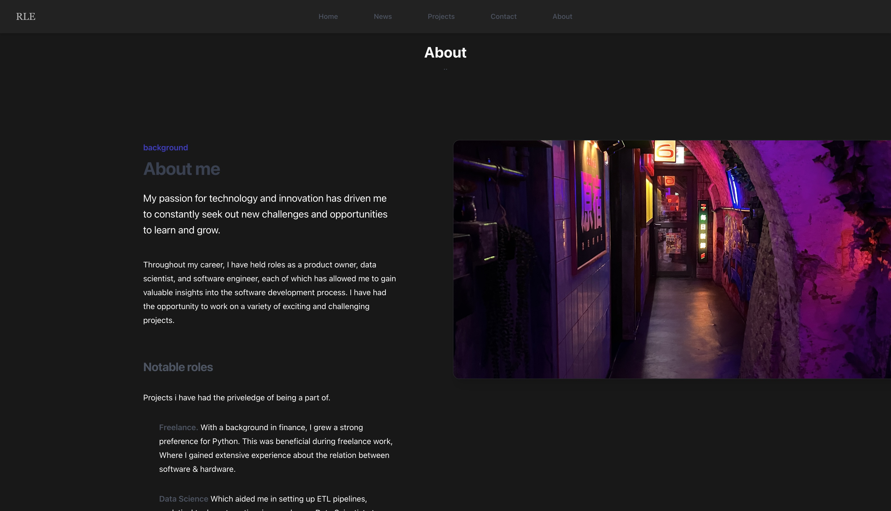

# VueStarter

A Quick and easy starting template for a vue blog or portfolio on firebase.

[Live Example](https://remcoeijsackers.com)


## Made with

* [Vue](https://vuejs.org/)
* [TailwindCSS](https://tailwindcss.com/)
* [Vite](https://vitejs.dev/)

## Styling

### Scalable and modern

Mobile                     |  Desktop                  |  Tablet
:-------------------------:|:-------------------------:|:-------------------------:
   |  |  

### Card based interface

Cards                       |  Nested views          |
:-------------------------:|:-------------------------:|
   |  


### Dark mode build in

Nested view - dark         |  About - dark             |
:-------------------------:|:-------------------------:|
   |  


## Getting Started

1. Install firebase-tools

```sh
npm i firebase-tools
```

2. Create an app on firebase

[Learn how here](https://firebase.google.com/docs/web/setup)

3. Initialise the firebase plugin

```sh
firebase init 
```

4. Install the dependencies

```sh
npm install
```

## Deploying

1. Build the project

```sh
npm run build
```

2. Deploy to firebase

```sh
firebase deploy
```

To take the project offline run

```sh
firebase hosting:disable
```

To bring it back up, run

```sh
firebase hosting:enable
```

## Disclaimer

This is not an example of best practices, It is just a starting template.
If you want to use this starter, please refer to the documentation of the respective frameworks
to improve it.